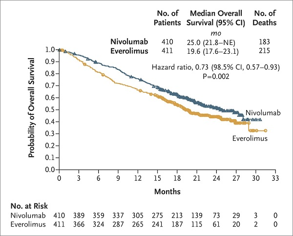

  
```{r setup, include = FALSE}
knitr::opts_chunk$set(
collapse = TRUE,
comment = "#>"
)
set.seed(1990)
```

```{r load premade rmd file, include = FALSE}
knitr::opts_chunk$set(echo = TRUE)
library(knitr)
library(survivalnma)
library(dplyr)
# collect filepaths
nmalist.rds <- system.file("extdata", "nmalist.RDS", 
                           package = "survivalnma", mustWork = TRUE)
nma.list <- readRDS(nmalist.rds)
dataframe <- data.frame(
  stringsAsFactors = FALSE,
  "treatment" = c("Suni", "Ifn", "Suni", "Pazo"),
  "study" = c("Study 1", "Study 1", "Study 2", "Study 2"),
  "baseline" = c("Suni", "Suni", "Suni", "Suni"),
  "filepath" = sapply(c("Mota_OS_Suni_KM.txt",
                 "Mota_OS_Ifn_KM.txt",
                 "Mot_OS_Suni_KM.txt",
                 "Mot_OS_Pazo_KM.txt"), function(x)
                   system.file("extdata", "narrow", x, package="survivalnma", mustWork=TRUE)))
```

# Introduction 

This vignette is intended as a walkthrough for the basic features of the `survivalnma` package and explain some concepts behind network meta-analysis of survival data to new users. We concentrate on an example of a single model with a simple analysis dataset. Note that all functions mentioned here have R documentation, e.g.

```{r, eval=FALSE}
library(survivalnma)
?survnma
```

For experienced WinBUGS users, all included models can be viewed

```{r, eval=FALSE}
survivalnma::survnma_model("weibull", "fixed") #will open a text file
```

To introduce our approach, see below the code for a complete (albeit simplified) analysis, which in four lines of code loads data, conducts analysis and outputs it all into a Word document.

```{r, eval = FALSE}
df <- read_km_folder("~/projects/18_cabo_nice/input") #read all Kaplan-Meier data
df <- filter(df, outcome == "os") #only analyse one of the outcomes
fit <- survnma(df, model = "weibull", type = "random") #estimate NMA parameters
generate_markdown(fit, output = "my_word_document.docx") #generate plots and tables, write them to Word
```

In this vignette we will walk through these features on a practical example.


## Network meta-analysis of parametric survival curves

We follow the approach originally by Ouwens _et al_ (1). Our objective is to meta-analyse survival data for many treatments by assuming that the true survival function follows some parameteric distribution (such as Weibull, Gompertz etc. etc.). In contrast to a "classical" (network) meta-analysis of survival data, we do not assume proportional hazards (which would lead to the meta-analysis of study-reported HR values) but analyse whole survival curves extracted from publications.

The `survivalnma` package is supposed to make this process fast and replicable. The underlying Bayesian NMA code has been replicated from (1) and (2) and uses WinBUGS; our contribution lies in making these models accessible and in providing a consistent analytic workflow.

## Network meta-analysis of hazard ratios

Network meta-analysis of survival data is often based on the reported hazard ratio, which relies on the proportional hazards assumption. This assumption is not only often implausible, but can have a huge impact on decisions based on cost-effectiveness analysis. In extreme cases survival curves intersect and the hazard ratio is not constant. Furthermore, even if survival functions do not intersect, the hazard functions might and the assumption is violated. 

We follow the approach originally by Jensen _et al_ (2). Patient-level data were reconstructed as described by Guyot _et al_ (3). A variety of first-order and second-order fractional polynomials with different power functions and models with fixed scale and shape, random scale and fixed shape, and random scale and random shape were conducted.


## Models available in the package

The models included in the package concern calculating average treatment effects $d$ while taking into account baseline risk $\mu$ and making use of the transitivity property of the network meta-analysis models. Both $d$and $\mu$ are multi-dimensional, depending on number of parameters in each model (see below). That means the treatment effect is expressed in terms of impact on multiple parameters. 

See the later section on how to interpret the model parameters for more details. In this section we only present the available models.


### Typical parametric models

The distributions in the following table are implemented in `survivalnma`. We summarise here for reader's understanding what the $h(t)$ and $S(t)$ functions are in each case. 

Family of distribution  |  Parameters      | Reparameterisation | Hazard function $h(t)$     | Survival function $S(t)$
------------------------|------------------|--------------------|---------------------------|--------------------------------
Exponential             | $\alpha$        |$\nu = \log(\alpha)$|$h(t) = \alpha$| $S(t) = \exp(-\alpha t)$|
Weibull                 | $\alpha > 0$,$\beta > 0$ |$\nu = \log(\frac{\alpha}{\beta^\alpha})$ $\theta = (\alpha - 1)$ | $h(t) = \exp({\nu+\theta log(t)})$ | $S(t) = \exp( -( \frac{\exp(nu)}{\theta +1})t^{\theta+1})$
Gompertz       |$\alpha > 0$, $\beta > 0$|$\nu = \log(a)$, $\theta = \beta$|$h(t) = \exp(\nu + {\theta t})$| $S(t) = \exp {\big[{\frac{log(\nu)}{\theta}(1-\exp({\theta t})}\Big]}$ 
Log-Normal              | $\alpha > 0$, $\beta^2 >0$|$\nu = \alpha$, $\theta = \log(\beta)$ |$h(t) =  \frac{\phi \left( \frac{\log(t)}{\sigma} \right)}{\sigma t \left[1 - \Phi \left( \frac{\log(t)}{\sigma} \right)\right]}$|  $S(t) = 1 - \Phi \left( \frac{\log(t) - \nu}{\exp(\theta)} \right)$
Log-Logistic            | $\alpha$,$\beta$  |$\nu = \log(\alpha^\frac{-1}{\beta})$,$\theta = \log(\beta)$| $h(t)= \frac{\exp^{\theta - \nu}(t\exp^{-\nu})^{\exp^{\theta}-1}}{1+(t\exp^{-\nu})^{\exp^{\theta}}}$ | $S(t)=\frac{1}{1+(t\exp(-\nu))^{\exp(\theta)}}$

* $\Phi(x)$ represents the incomplete normal integral $\int_{-\infty}^{x}{\phi(s)ds}$ with $\phi(x)={\frac{1}{\sqrt{2\pi}}{\exp{\frac{x^2}{2}}}}$ being the probability density function of the standard normal distribution. 
* Some distributions, especially Weibull and Gompertz have been or can be reparametrised for ease of use. Please refer to relevant information [here](https://sundoc.bibliothek.uni-halle.de/habil-online/07/07H056/t3.pdf)
* The Gamma distribution has been omitted due to the lack of a closed form expression (contains incomplete gamma integral) which imposes computational problems. It is of limited interest but more information can be found at the link above.
* Log-Normal distribution also relies on the incomplete normal integral making computations quickly formidable. Nevertheless, there are diverse situations where it can be of use and thus has been included.


### Fractional polynomials

We consider a range of first and second order fractional polynomials. A fractional polynomial is just a polynomial with non integer powers. Typically we consider five models for both orders, but this is not necessary.

Polynomial | Model 1 | Model 2 | Model 3 | Model 4 | Model 5
----------|----------|---------|-------- |---------|-----------
First Order | $P = 0$ | $P = 1$| $P = 0.5$ | $P = -1$ | $P = -0.5$
| | | | |
Second Order | $P1 = -0.5,\\ P2 = 0$| $P1 = -1,\\ P2 = 0$ | $P1 = -1,\\ P2 = 1$|$P1 = -1,\\ P2 = -1$ |$P1 = -1,\\ P2 = 0.5$

With the above set of polynomial powers you can achieve many different shapes for the hazard functions. 
Such shapes can mimic a constant hazard over time, a linear increasing or decreasing hazard over time and bathtub shaped hazard. 

Specifically for first order polynomials of the form $\ln(h_{kt}) = \beta_{0k} + \beta_{1k} t^p$ with $t^0 = log(t)$:  

*  If you set the coeffcient $\beta_1$ equal to 0, a constant loghazard function is obtained, reflecting exponentially distributed survival times.     
*  If $\beta_1 \neq 0$ and $p = 1$ a linear hazard function is obtained which corresponds to a Gompertz survival function.     
*  If $\beta_1 \neq 0$ and $p = 0$ a Weibull hazard function is obtained, and $\pmatrix{ d_0 \\ d_1}$ reflects the difference in respectively the scale and shape of the Weibull log hazard curve for treatment effect $d$.

Extending the first order fractional polynomial hazard function to a second-order fractional polynomial increases the possible (differences in) shapes even further.


# Data and network preparation

## NMA of HRs 

[This is currently not supported within the package. We will expand this guide with details on HR analysis later.]


## Curve extraction

Typically aggregate survival data is obtained from published Kaplan-Meier curves by using digitizing software. This is an example of curve obtained from an oncology trial (see (4)):



We typically use [DigitizeIt](https://www.digitizeit.de/) to extract the curve. It requires a published Kaplan Meier curve as input (usually in `png` or `pdf` format). After defining axis start/end points, the analyst is required to either manually select plot points or use the softwares recognition tools to "scan" the curve. This provides an accurate estimate of the curve's path, but the result is dependent on the analyst's accuracy. 

The software then supplies a digitized version of the curve, in a text format. A final step is required before we can use the data. Analyst modifies the data (e.g. in Excel) by adding numbers at risk where available. This is crucial in the analysis. 

By default we assume that the user will supply text files corresponding to individual Kaplan-Meier curves. That is, each file will have columns corresponding to `"time"`, `"n.risk"`, `"n.event"`. Note that the columns __do not have to follow this naming convention, but have to follow this ordering.__)


## Data preparation

Before conducting analysis, inputs need to be formatted correctly. The function will require a `data.frame` with 4 columns: `treatment`, `study`, `baseline` and `filepath`. Their meaning is self-explanatory. Each row corresponds to a single arm (single extracted curve).

Each linked file via `filepath` should be the corresponding data extracted from the Kaplan Meier plots, as explained above. 

Only two-arm studies are supported at the moment.

### Automated data preparation

[Currently this feature has not been included in the public release of the package – we will consider it for release in the future versions.]

### Defining baselines

Defining the baseline for each study/treatment pair is important. Although this can be done manually, we supply a function, `add_baseline_column` that does so automatically. Choice of baseline needs to be consistent with the selection of studies supplied. It needs to connect treatments, forming a network for the comparisons to make sense. Usually, treatments are given an identification number, and the lowest integer identifier is chosen as that study's baseline. This guarantees that all present studies will have a baseline treatment present in another study.

For this example we will be using a premade dataframe we supply together with the package. Normally, you would have a folder that would contain all the text (.txt) files of your data. You would then use read_km_folder to automatically read the folder to a more managable dataframe in R.

Let's see what the dataframes supplied look like. As they come with the package you can access them via `survivalnma::mrcc_small`.

```{r loading data small}
# This is the short dataset
print(survivalnma::mrcc_small)
```

# Plots

## Plotting the network

[Currently this feature has not been included in the public release of the package – we will consider it for release in the future versions.]

## Plotting Kaplan Meier curve

Plotting Kaplan-Meier curves relies on external packages `survival` and `survminer` (function `ggsurvplot`). These will NOT be installed automatically when user installs `survivalnma`.

1. KM survfit object. This is the output of the `survival::survfit` function  
2. IPD data used to generate the above survfit object

It then outputs a standard Kaplan-Meier curve

```{r survival, eval=FALSE, fig.width= 8, fig.height= 5}
# read data
IPD.data <- read.table(system.file("extdata","narrow", "Mota_OS_Ifn_IPD.txt", 
                                       package = "survivalnma", mustWork = TRUE))
colnames(IPD.data) <- c("time", "event", "arm")

# run survfit to create survival object
KM.est <- survival::survfit(survival::Surv(time, event)~1,
                            data=IPD.data,
                            type="kaplan-meier")
# This is what `survminer` plots for KM curves
km.plot <- survminer::ggsurvplot(KM.est, data = IPD.data, legend.labs = "Kaplan Meier")
plot(km.plot$plot)

```


## Testing proportionality of hazards

[Currently this feature has not been included in the public release of the package – we will consider it for release in the future versions.]

***
# NMA model via `survnma()` function


## Setting up WinBUGS

The package uses WinBUGS software and `R2WinBUGS` package. The default location for the program files of WinBUGS is expected to be stored in the root directory `"C:\WinBUGS14"`. If you have your own filing system and want to change the location of this directory then you need to inform `survivalnma`. 

This alteration is easy. When running `survnma()` make sure to pass the additional parameter `bugs.directory = "PATH TO WINBUGS"`.

For example, if you stored WinBUGS at `"C:\Program Files (x86)\"` then when calling `survnma` you should do the following:

```{r, eval = FALSE}
fit <- survnma(nma_df = mrcc_small, model = "weibull", bugs.directory = "C:/Program Files (x86)/WinBUGS14")
```

We recommend that you save WinBUGS at `C:/WinBUGS14/` to avoid this extra work.


## `survnma()` function 

The survnma function is the fundamental function in the `survivalnma` package. It runs WinBUGS NMA models and formats the outputs to make them user-friendly for later analysis.

input variable | description
---------------|--------------------------------------------------------
nma_df             | `data.frame` with studies, treatments, baselines and paths to files (see above)
model          | string specifying the model type: for now we have `"weibull"`, `"gompertz"`, `"exponential"`, `"loglogistic"`, `"lognormal"`, `"fp1"`, `"fp2"`
type           | `"fixed"` or `"random"` effects (default is fixed)
prior          | `prior` distribution of parameters. List of prior values with elements `mean`, `prec2`, and                   `R` to be passed to WinBUGS. If `NULL`, the defaults are used. Dimensionality depends on                    distribution family: 1 for `exponential`, 3 for `fp2` and 2 for all others.
inits          | Initial values for chain. If left `NULL` WinBUGS will generate, if set to `generate`                       initial values will be generated within R.
P              | powers to be used with the fractional polynomials (one or two values)
...            | more optional arugments; you can use WinBUGS arguments such as `n.chains`, `n.iter`


Observe the simple Weibull model below. (Note that the results are likely wrong as we purposefully ran the model for a very short time.) 

```{r nma introduction, eval = FALSE}
# Construct the survnma object
weibull.nma <- survnma(nma_df = dataframe, "weibull", type = "fixed", n.iter = 500, min_time_change = 0.05)

# The object has stored the following attributes
attributes(weibull.nma)

# WinBUGS model is included in our NMA result
# And it's shown by default:
weibull.nma
```


```{r nma introduction2, echo=FALSE}
# Construct the survnma object
temppath <- system.file("extdata", "weibull_nma.Rds", package = "survivalnma", mustWork = TRUE)
weibull.nma <- readRDS(temppath)


# The object has stored the following attributes
attributes(weibull.nma)

# WinBUGS model is included in our NMA result
# And it's shown by default:
weibull.nma
```

More complicated models like fractional polynomials or random-effect models are all ran with the same function (once again it will not converge during this short run):

```{r, eval = FALSE}
fp1.nma <- survnma(mrcc_small,
                   "fp1", P = 1, 
                   type = "fixed", min_time_change = 0.05)

fp2.nma <- survnma(mrcc_small, 
                   "fp2", P = c(2.3, 0.23),
                   type = "random", min_time_change = 0.05)

# Extract model name
fp2.nma$model
# Extract powers used
fp2.nma$P
```

## Automatic convergence for the models

The package `survivalnma` also has the ability to continuously run a model until convergence has been reached. This is determined by checking the largest `Rhat` value (a measurement of fitness). If you specify `auto_restart = TRUE` while generating your survnma object, then it will automatically re-run the operation at most 5 times or until `Rhat` is less than 1.05


By default, the option for `warnings` is automatically enabled, informing you whether the model has converged or the limit of iterations has been reached. To disable this, just pass `r warnings = FALSE` when calling `survnma`

```{r auto_rest, eval = FALSE}
#AUTO RESTART ON
survnma.object <- survnma(nma_df = data, 
                          model = "weibull", 
                          auto_restart = TRUE,
                          warnings = FALSE)

# We enable auto_restart but disable the warnings
```

Regardless whether you specified `auto_restart = TRUE` or not, you will be warned if `Rhat > 1.05` given that `warnings = TRUE`

## Understanding model parameters

As you can see from the WinBUGS result above, we can identify the parameters of each unique treatment effect (`d`) and each study baseline (`mu`).

For `mu[i,j]`:

* `[i]` represents the treatment, in this case there are 3 treatments so `[i]` spans from one to three
* `[j]` represents the parameters of the model; e.g. when considering a second order fractional polynomial which has parameters `b0`, `b1` and `b2`; these are in positions `mu[i, 1]`, `mu[i, 2]` and `mu[i, 3]`; when considering Weibull model, two `j`'s are scale `nu` and shape `theta` of log-hazard curves

For `d[i,j]`, `j` is still the model parameters, but `i` spans all treatments in the network. Value of `d` is always calculated in reference to the global baseline treatment (indexed by 1). Therefore, by definition, `d[1,j]` is zero for all `j` and therefore not shown in outputs. 

We can always calcualte relative effect of two treatments A and B by calculating parameter $\delta = d_B - d_A$. This is in fact how the transitivity property of the network meta-analysis is implemented in the WeinBUGS models. See Ouwens _et al_ publication for more details.

***

# Working with the NMA results

In `survivalnma` we provide the ability to calculate and plot the survival function of all models.

## Survival curve results

In the survival curve NMA framework, survival curves can only be plotted in relation to baseline value of `mu` (study-specific baseline). 

You can plot with `survival_plot`. 

```{r survival prep, fig.width= 7, fig.height= 5}
# You have to specify study to "adjust to"
# As default all treatments are plotted
survival_plot(weibull.nma, study = "mot", 
              timesteps = seq(0,30))
```

Setting a short `timesteps` interval will result in more "jagged" plots but will speed up calculations. See `?survival_plot` for various arguments to customise your plots.

> _Note_: We provide two functions for survival curves, one for calculation and one for plotting. The reason for this is that some of survival calculations take a long time, so sometimes you may want to precalculate the results and save them for later use.

```{r survival plot, eval = FALSE}
curve_data <- prep_all_survivals(weibull.nma, study = "Study 1")
survival_plot(curve_data)
#would generate the same result
#but we now have access to curve_data for future use
```


## Hazard ratio results

For HR the derivation and plotting is similar as for survival curves. For HR no study is needed to adjust to, as we deal with relative quantities.

Again you can either pre-calculate the hazard ratios using `prep_all_hazards` or just pass directly into `hazard_plot` a survnma object together with the corresponding study, treatments and reference for the internal calculation.

```{r hazard mock, eval = FALSE}
# if you precalculated
hazard_data <- prep_all_hazards(nmafit = weibull.nma, 
                                treatments = c("Ifn", "Suni", "Pazo"), 
                                reference = "Suni")
hazard_plot(data = hazard_data)

# OR alternatively 

hazard_plot(data = survnma.object,
            treatments = c("trt1", "trt2", "trt3", "trt4"),
            reference = "trtX")

```

```{r hazard plot, fig.width= 7, fig.height= 5, echo= FALSE}
hazard_plot(weibull.nma, reference = "suni")
```


## Assessing fit to data (WIP)

The Kaplan-Meier plots can be compared against the fitted data via `kaplan_plot()`. It uses the `survnma` object altogether with IPD data.

[Currently this feature has not been included in the public release of the package – we will consider it for release in the future versions.]

## Gelman-Rubin (R-hat) and its interpretation

The Gelman-Rubin diagnostic, ($\hat{R}$), is a measure of convergence for a list of MCMC sequences. Without getting into details, it uses the Within-Chain and Between-Chain variances of the MCMC to conclude whether the collection of chains has converged to the target posterior distribution.  

Following Gelman and Rubin's suggestion of utilising the potential scale reduction factor, MCMC convergence should yield an $\hat{R}$ value of close to 1.


***

## Tabular outputs

The function `hazard_table()` can produce multiple hazard-ratio tables for every consequtive month. It requires an input of a `survnma` object together with specified `study`, `treatments`, `reference` and `timesteps`. Timesteps should be the times you want the evaluation to occur at. 

It can also utilise pre-calculated hazards. If it happens that you have already calculated hazards, you can pass directly the hazard object, which would decrease the computation time drastically.


```{r hrtable snippet, eval = FALSE}
# if you calculate hazards previously,
survnma.object <- survnma(nma_df = mrcc_big, model = "weibull")
hazards <- prep_all_hazards(survnma.object, 
                            treatments = c("trt1", "trt2"),
                            reference = "ref", timesteps = seq(0, 30, 3))

hazard_table(survnma.object, hazards = hazards, print = TRUE)

# if you want to do it internally
survnma.object <- survnma(nma_df = mrcc_big, model = "weibull")
hazard_table(survnma.object, c("trt1", "trt2"), "ref", timesteps = seq(0, 30, 3), print = TRUE)
```
```{r hrtable calc, results = "asis", echo = FALSE}
data <- hazard_table(weibull.nma, c("ifn", "pazo"), reference = "suni", print = FALSE, timesteps = seq(0, 30, 3))
kable(data[1:6,], caption = "3-Month Hazard Ratio Table", digits = 2)
```

Similarly, the function `survival_table()` evaluates the survival rate at multiple time points for any treatment specified. Again, you are required to supply a `survnma` object together with the `study` of interest, `treatments` and `timesteps` which determines when the survivals are evaluated. 

If you have pre-calculated any survivals you can pass them directly, by supplying them in the `survivals` argument. Changing `print` to `FALSE` will not print results to console.

```{r survtable snippet, eval = FALSE}
# if you calculate hazards previously,
survnma.object <- survnma(nma_df = mrcc_big, model = "weibull")
survivals <- prep_all_survivals(survnma.object, 
                                study = "Study 1",
                                treatments = c("trt1", "trt2"),
                                timesteps = seq(0,30))

survival_table(survnma.object, survivals = survivals, print = TRUE)

# if you want to do it internally
survnma.object <- survnma(nma_df = mrcc_big, model = "weibull")
survival_table(survnma.object, "Study 1", c("trt1", "trt2"), timesteps = seq(0,30), print = TRUE)
```

```{r survtable calc, results = "asis", echo = FALSE}
data <- survival_table(weibull.nma, "mot", c("ifn", "suni", "pazo"), timesteps = seq(0,30),print = FALSE)
kable(data[1:10,], caption = "Monthly Survivals Table")
```


***

## Automatic reporting of results

We have constructed a script that automatically generates a Word document (can be changed to html/pdf) of your analysis. 

[Currently this feature has not been included in the public release of the package – we will consider it for release in the future versions.]

***

# References & credits

Vignettes and code in the `survnma` has been created at Certara by Witold Wiecek and Savvas Pafitis with contributions and valuable comments from our colleagues Shuai Fu, Johanna Lister and Jie Meng. Original parametric curve models are sourced from work cited in references. They are primarily work of MJ Ouwens and JP Jansen.

(1) Ouwens, Mario J. N. M., Zoe Philips, and Jeroen P. Jansen. “Network Meta-Analysis of Parametric Survival Curves.” Research Synthesis Methods 1, no. 3–4 (July 2010): 258–71. https://doi.org/10.1002/jrsm.25.

(2) Jansen, Jeroen P. “Network Meta-Analysis of Survival Data with Fractional Polynomials.” BMC Medical Research Methodology 11, no. 1 (May 6, 2011): 61. https://doi.org/10.1186/1471-2288-11-61.

(3) Guyot, Patricia, AE Ades, Mario JNM Ouwens, and Nicky J. Welton. “Enhanced Secondary Analysis of Survival Data: Reconstructing the Data from Published Kaplan-Meier Survival Curves.” BMC Medical Research Methodology 12, no. 1 (February 1, 2012): 9. https://doi.org/10.1186/1471-2288-12-9.

(4) Motzer, Robert J., Bernard Escudier, David F. McDermott, Saby George, Hans J. Hammers, Sandhya Srinivas, Scott S. Tykodi, et al. “Nivolumab versus Everolimus in Advanced Renal-Cell Carcinoma.” New England Journal of Medicine 373, no. 19 (September 25, 2015): 1803–13. https://doi.org/10.1056/NEJMoa1510665.
